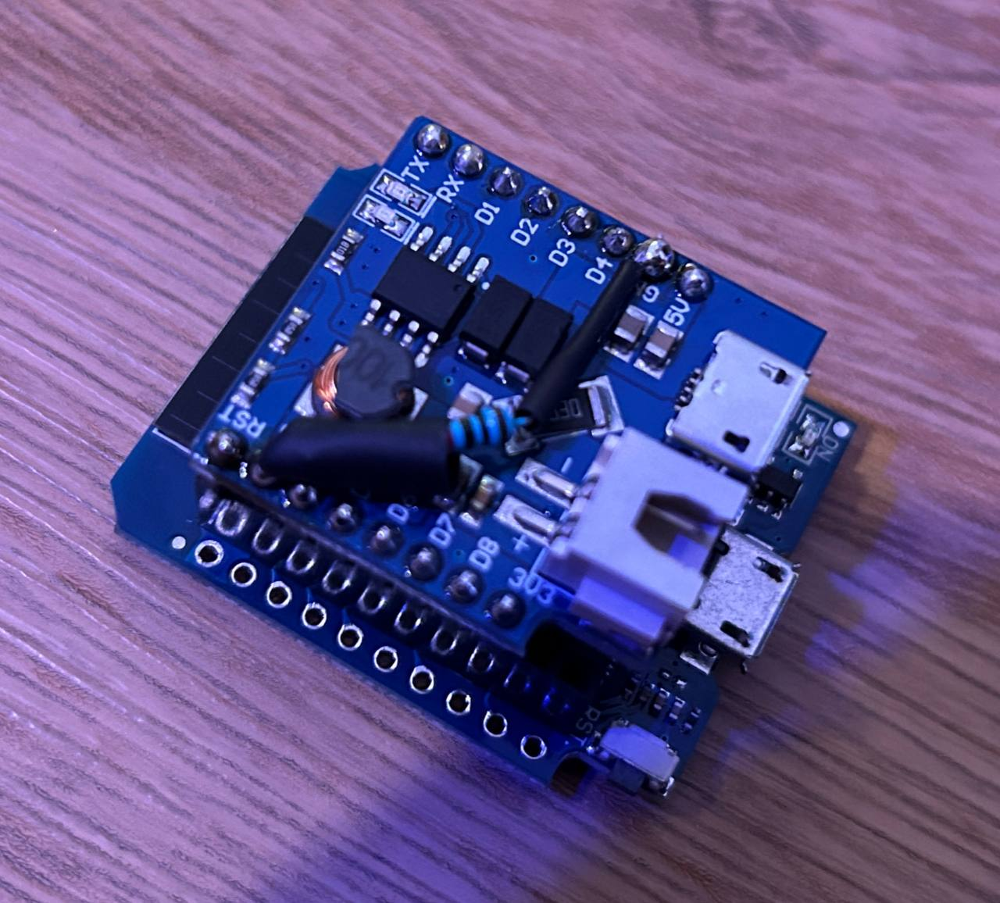
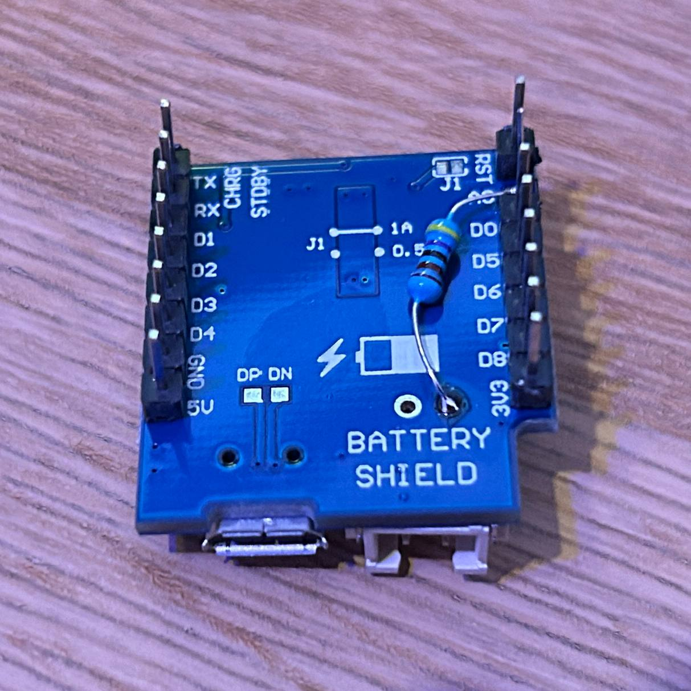

# ESP32 - Battery Shield 

This project demonstrates how to connect a 3.7V LiPo battery to the LiPo shield for the D1 and enables the ability to read the battery voltage.

## Hardware

### Used Hardware

* AZ-Delivery: [Battery Shield for lithium batteries for D1 Mini
](https://www.az-delivery.de/en/products/batterie-shield-fuer-lithium-batterien-fuer-d1-mini)
* BerryBase: [Battery / LiPo Shield für D1 Mini](https://www.berrybase.de/en/battery/lipo-shield-fuer-d1-mini)

### Wireing

When measuring higher voltages (like a battery) with the ESP32 ADC, you typically use a voltage divider to scale down the voltage to a range the ADC can handle. A voltage divider uses two resistors (R1 and R2) to scale down the input voltage.

```bash
  + Battery
    |
   [R1] 4.7kΩ 
    |
    |--- ADC (ESP32 Pin 36)
    |
   [R2] 10.0kΩ
    |
   GND
```

The formula for the output voltage $V_{Battery}$ from the voltage divider is:

$V_{adc} = V_{Battery} \times \frac{R2}{R1 + R2}$

 

### How to Get the Battery Percentage

The [Analog to Digital Converter (ADC)
](https://docs.espressif.com/projects/esp-idf/en/v4.4/esp32/api-reference/peripherals/adc.html) of the ESP32 operates within a voltage range of 0V to 3.3V and has a 12-bit resolution, meaning it can represent values from 0 to 4095.

To read the analog value from the ADC pin, use the following code:

```cpp
int adcPin = 36
float analogValue = analogRead(adcPin);
```

Next, convert the analog value to the pin voltage:

```cpp
float pinVoltage = analogValue * (3.3 / 4095.0);
```

**Reverse the Voltage Divider Calculation**

When measuring higher voltages (like a battery) with the ESP32 ADC, you typically use a voltage divider to scale down the voltage to a range the ADC can handle. A voltage divider uses two resistors (R1 and R2) to scale down the input voltage. The formula for the output voltage $V_{Battery}$ from the voltage divider is:

$V_{Battery} = V_{adc} \times \frac{R1 + R2}{R2}$

Here's how you can apply this in code:

```cpp
float batteryVoltage = pinVoltage / R2 * (R1 + R2);
```

This formula rearranges the terms to solve for $V_{Battery}$, allowing you to calculate the actual battery voltage from the measured pin voltage. For a 3.7V LiPo battery, the voltage range is 3.0V for 0% capacity and 4.2V for 100% capacity. Calculate the battery percentage as follows:

```cpp
float batteryVoltage = getVoltage();
if (batteryVoltage < vmin) batteryVoltage = vmin;
if (batteryVoltage > vmax) batteryVoltage = vmax;
float percentage (batteryVoltage - vmin) / (vmax - vmin) * 100.0;
```

By following these steps, you can determine the battery percentage of a 3.7V LiPo battery using the ESP32 ADC.

## Additional Resources

### ESP32 ADC Pins (Analog to Digital Converter)

- ESP32 D1 Analog Input Pins: 0V - 3V3, 12-bit (4096 values)
- [Tutorial](https://randomnerdtutorials.com/esp32-adc-analog-read-arduino-ide/)

> [!IMPORTANT]  
> The ADC can only measure a voltage between 0 and 3.3V. You cannot directly measure analog voltages between 0 and 5V.

> [!WARNING]  
> ADC2 cannot be used with enabled WiFi since it is used internally by the WiFi driver. Since there is a good chance of using WiFi on a microcontroller designed to use it, only the ADC1 and its 8 channels can be used.

### Battery Shield

#### Product Description

This lithium battery shield provides a means of powering your D1 mini, or D1 mini Pro from a single cell (3.7V) lithium battery via a JST PH 2mm 2Pin connector. The shield contains a DC-DC converter to step-up the batteries 3.7V to 5V supplying your D1 Mini and shields with up to 1A of power. When the battery is depleted simply plug the shield into a USB power source using a mini USB cable and it will automatically recharge the battery. Two LEDs on the shield indicate when the battery is charging and when charging has completed.

- [AZ Devlivery Lipo Shield Datasheet](docs/D1%20mini%20Battery%20Shield%20DE.pdf)
- [BerryBase Lipo Shield Datasheet](docs/Battery-LiPo-Shield-fuer-D1-Mini.pdf)

#### Features

- Charging Voltage: max: 10V, recommended: 5V
- Charging Current: 500mA / 1A
- Lithium Battery Voltage: 3.3-4.2V
- Boost Power Supply: 5V(max: 1A)
- Dimensions: 28.5x26x7mm

#### Pins

- 5V: 5V(max: 1A) Power Supply
- GND: Ground

#### Connections

- XH-2.54MM (Port 1): Connection to Lithium Battery (normally 3.3-4.2V)
- Micro USB (Port 2): Charging Port (normally 5V)
- Blue LED lights up when charging is complete.
- Red LED lights up during charging.
- J1: Set the maximum charging current to 0.5A or 1A.
